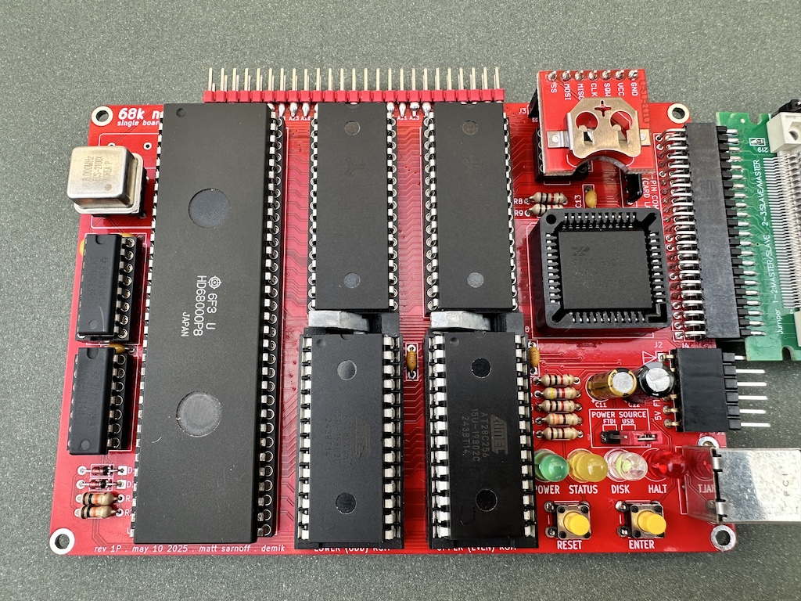

# 68k nano+

A minimal single-board computer based on the venerable ["Texas Cockroach"](https://youtu.be/UaHtGf4aRLs?t=2074)
Motorola 68000 16/32-bit microprocessor.



This is a variant from the original that Matt Sarnoff designed and published ["here"](https://github.com/74hc595/68k-nano). 

It was created to use 16550 UARTs in PLCC-44 form that are avaiable brand new instead of playing the lottery with old parts (the DIP variant from the original board isn't manufactured anymore)

There is also a small memorymap helper which tiddy up the memory map (see below). It is totally optional.

This variant is named 68k-nano+ (because of the PLCC socket and the extra memory helper) to differentiate it from the original one.

## Features

- 68HC000 processor running at 12MHz
- 1MB RAM
- 64KB ROM
- 16550 UART providing a 5V FTDI serial port
- 44-pin IDE connector for CompactFlash card adapter
- Connector for SparkFun DS3234 real-time clock
- Only two 74HC glue logic chips required

It chas been tested with [FUZIX](https://codeberg.org/EtchedPixels/FUZIX) and is running just fine. You can of course run the original ROM.


## Hardware

The 68k nano(+) hardware is simple and straightforward. It can be built on a
breadboard (though there may be stability issues at higher clock speeds).


### Memory map

Due to the minimal address decoding circuitry, accessing certain memory regions will cause multiple devices to be selected. This should be avoided.

#### Original memory map

```
$000000-0xFFFF     ROM (repeats 16 times)
$100000-1FFFFF  X  Forbidden (multiple devices selected)
$200000-2FFFFF     ROM (mirror of $000000-0FFFFF)
$300000-$7FFFF  X  Forbidden (multiple devices selected)
$800000-8FFFFF     Open bus (available for expansion)
$900000-9xxxxF     CompactFlash card
$A00000-AxxxxF     UART
$B00000-BFFFFF  X  Forbidden (multiple devices selected)
$C00000-CFFFFF     RAM
$D00000-DFFFFF  X  Forbidden (multiple devices selected)
$E00000-EFFFFF     RAM (mirror of $C00000-CFFFFF)
$F00000-FFFFFF  X  Forbidden (multiple devices selected)
```

This is summarized with the following equations:

```
/ROMSEL  = /A23
/RAMSEL  =  A22
/UARTSEL =  A23 * /A22 * A21
/CARDSEL =  A20
```

#### Extended memory map (with helper)

This change the original memory map above from 

````
000000-0fffff	ROM 
100000-1fffff	ROM CARD 
200000-2fffff	ROM 
300000-3fffff	ROM CARD 
400000-4fffff	ROM RAM 
500000-5fffff	ROM RAM CARD 
600000-6fffff	ROM RAM 
700000-7fffff	ROM RAM CARD 
800000-8fffff	
900000-9fffff	CARD 
a00000-afffff	UART 
b00000-bfffff	UART CARD 
c00000-cfffff	RAM 
d00000-dfffff	RAM CARD 
e00000-efffff	RAM 
f00000-ffffff	RAM CARD 
````

to

````
000000-0fffff	ROM 
100000-1fffff	ROM CARD 
200000-2fffff	ROM 
300000-3fffff	ROM CARD 
400000-4fffff	ROM RAM 
500000-5fffff	ROM 
600000-6fffff	ROM RAM 
700000-7fffff	ROM 
800000-8fffff	
900000-9fffff	CARD 
a00000-afffff	UART 
b00000-bfffff	UART CARD 
c00000-cfffff	RAM 
d00000-dfffff	
e00000-efffff	RAM 
f00000-ffffff
````

Two new IO ranges are now avaiable. They can be used for example to extend the memory area to 2MB using an external board.

### Building it

`bom.txt` contains a bill of materials. As of this writing (June 2026), all components are available from major distributors like [Mouser](https://mouser.com) and [Jameco](https://jameco.com). If purchasing 68000s from eBay, note that [vintage
ICs are a common target of counterfeiters](https://medium.com/supplyframe-hardware/the-underground-parts-store-identifying-counterfeit-computer-chips-3020adbb01f7).

All parts are through-hole for that extra vintage feel. Note that some of the decoupling capacitors (C4, C5, C6, C8, and C10) are underneath ICs, so open-frame IC sockets are required. Large IC sockets can also be expensive (_especially_ DIP-64 sockets!) so a cheaper alternative is to use [breakaway SIP 0.1" machine-pin headers](https://www.amazon.com/dp/B0187LTEX2/ref=cm_sw_em_r_mt_dp_U_M5IbFbVJ3NVDH).

To keep the board in this spirit with the PLCC-64 UART, you will also need a PLCC-44 THT socket.

For the ROMs U5 and U7, [Aries 28-526-10 low-profile ZIF sockets](https://www.jameco.com/shop/ProductDisplay?catalogId=10001&langId=-1&storeId=10001&productId=102745) will fit, but _barely_. The release latch may scrape against the RAM IC to its north, but Matt found that it's not a huge deal. I can confirm that statement. If you can afford the Aries sockets, go for them.

You can use either a full-can or half-can oscillator for X1. Check the original README.md or FUZIX build instructions if the clock is something other than 12 MHz.

The 44-pin IDE header accepts a CompactFlash adapter board such as [this one](https://www.amazon.com/gp/product/B07Y2MTS13), available from Amazon and other vendors.

Some adapters are male, so you will need a matching female socket on the board. `bom.txt` contains a few parts number for this.

If not using the additional memory helper, do not populate R8, R9 and U9. Jumer two wires, _do not short both_, following to the markings on the silkscreen:

- U9 pin 3 to U9 pin 6
- U9 pin 2 to U9 pin 5

The gerbers files can be downloaded from the [releases section](https://github.com/demik/oldworld/releases/download/68k-nano%2B%2Fv1P/68k_nano+_1P.zip)

## Additional information

For more information, please check the original [README.md](https://github.com/74hc595/68k-nano/blob/master/README.md)


## About

Open hardware, released under the terms of the 3-clause BSD license.

Copyright 2020-2026 Matt Sarnoff.
Modified by demik in 2026.
