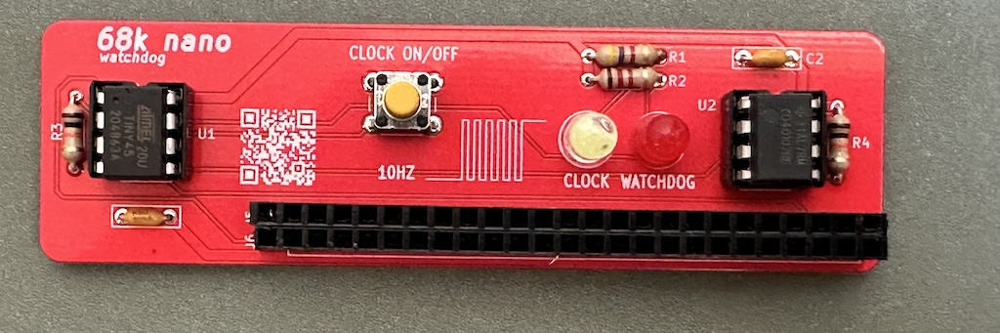

# 68k nano watchdog

Minimalistic watchdog build around an ATtiny45 for the 68k-nano(+).

## Features

- generate an external 10 Hz interrupt for FUZIX if running without an RTC
- monitor RAM accesses and enable a LED if no access have been done for a few seconds (crash)

## Hardware

The 68k nano watchdog hardware is very simple and straightforward. It can be built on a
breadboard as well.

### Building it

#### BOM

| Reference(s)          | Value      | Quantity | Notes                                  | Part number           |
|-----------------------|------------|----------|----------------------------------------|-----------------------|
| D2                    | -          | 1        | 5mm THT red LED                        |                       |
| D1                    | -          | 1        | 5mm THT color LED (other color)        |                       |
| C1, C2                | 100nF      | 1        | axial ceramic capacitor 3.8x2.6mm      | KEMET C412C104K5R5TA  |
| J5, J6                | 2x25       | 1        | 2x25 pins socket 2.54mm pitch          |                       |
| R1, R3                | 1kΩ+       | 2        | standard 1/4W carbon resistor for LEDs |                       |
| SW1                   | OFF-(ON)   | 1        | standard tactile button switch (6mm)   |                       |
| U1                    | ATtiny45   | 1        | 8-bit Microcontrollers - MCU           | ATTINY45-20PU         |
| U2                    | CD40107    | 1        | Logic Gates Dual 2-Input NAND          | CD40107BE             |

As of this writing (June 2026), all components are available from major distributors like [Mouser](https://mouser.com) and [Jameco](https://jameco.com).

All parts are through-hole for that extra vintage feel.

The gerbers files can be downloaded from the [releases section](https://github.com/demik/oldworld/releases/download/68k-nano%2B%2Fv1P/68k_nano_watchdog.zip)

#### Code

The MCU code is inside the ATtiny45 directory. There is a pretty much complete Makefile here (type make help)

You will also need avr-gcc

## Additional information

You may need some programer for the ATtiny45

## About

Open hardware, released under the terms of the 3-clause BSD license.
