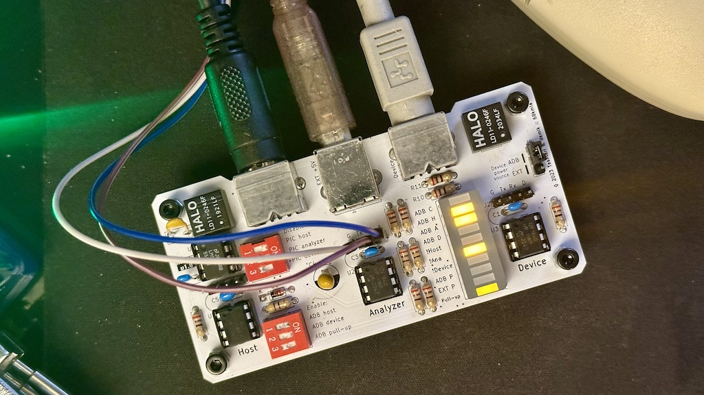

# ADBDB
Developer/Debug Board based on [tashtari](https://github.com/lampmerchant) work.

It was created because working on a breadboard work until you start fixing more the breadboard than doing actual work

It's a small PCB (10cm x 5cm) hosting all three ADB tools ([test-host](https://github.com/lampmerchant/adb-test-host), [test-device](https://github.com/lampmerchant/adb-test-device), [adb-analyser](https://github.com/lampmerchant/adb-protocol-analyzer)) with a few features:

* use external power for onboard electronics (using USB type B connector)
* signal filtering (using the same ADB filters as a Macintosh SE)
* external ADB device can be powered by either the Mac or external power
* on demand ADB 470Ω data line pull-up
* 200 mA PPTC resettable fuse to protect the Mac ADB port from overcurrent
* each tool can be enabled or disabled using dip switches
* each end (Macintosh or Device) can be enabled or disabled using dip switches
* a few debug LEDs (power status, activity, modes…)
* UART headers for each tool as well as the ADB data line so you can plug a scope or a logic analyzer
* selectable power source for the ADB device (either from the Macintosh or external power)



### Usage

Top set of DIP switches are used to _disable_ each one of the tools

Bottom set of DIP switches are used for various functions:

* connect the ADB data line to the Macintosh
* connect the ADB data line to the device
* additional 470Ω data line pull-up

Example usage:

To sniff the data between a Macintosh and an ADB divice, set "Disable PIC host" to on, enable "ADB host" and "ADB device", do NOT enable ADB pull-up

1. Connect the external power (+5V)
2. Connect the Mac ADB port to the host side (left)
3. Connect the ADB device on the device side (right)
4. Connect a TTL UART to the analyzer header and launch an analyzer session

Example of session of a Quadra 650 booting with a mouse attached:

```
(19:22:47) (0x00) SendReset x 2
(19:22:58) (0x0F) 0, Talk 3 6E 00 -- -- -- -- -- --  n.   
(19:22:58) (0x1F) 1, Talk 3 -- -- -- -- -- -- -- --       
(19:22:58) (0x2F) 2, Talk 3 -- -- -- -- -- -- -- --       
(19:22:58) (0x3F) 3, Talk 3 69 01 -- -- -- -- -- --  i.   
(19:22:58) (0x4F) 4, Talk 3 -- -- -- -- -- -- -- --       
(19:22:58) (0x5F) 5, Talk 3 -- -- -- -- -- -- -- --       
(19:22:58) (0x6F) 6, Talk 3 -- -- -- -- -- -- -- --       
(19:22:58) (0x7F) 7, Talk 3 -- -- -- -- -- -- -- --       
(19:22:58) (0x8F) 8, Talk 3 -- -- -- -- -- -- -- --       
(19:22:58) (0x9F) 9, Talk 3 -- -- -- -- -- -- -- --       
(19:22:58) (0xAF) A, Talk 3 -- -- -- -- -- -- -- --       
(19:22:58) (0xBF) B, Talk 3 -- -- -- -- -- -- -- --       
(19:22:58) (0xCF) C, Talk 3 -- -- -- -- -- -- -- --       
(19:22:58) (0xDF) D, Talk 3 -- -- -- -- -- -- -- --       
(19:22:58) (0xEF) E, Talk 3 -- -- -- -- -- -- -- --       
(19:22:58) (0xFF) F, Talk 3 -- -- -- -- -- -- -- --       
(19:22:58) (0x0B) 0, Lstn 3 0F FE -- -- -- -- -- --  ..   
(19:22:58) (0x0F) 0, Talk 3 6B 00 -- -- -- -- -- --  k.   
(19:22:58) (0x3B) 3, Lstn 3 0E FE -- -- -- -- -- --  ..   
(19:22:58) (0x3F) 3, Talk 3 -- -- -- -- -- -- -- --       
(19:22:58) (0xEB) E, Lstn 3 03 FE -- -- -- -- -- --  ..   
(19:22:58) (0xEF) E, Talk 3 -- -- -- -- -- -- -- --
```

Warning: avoid connecting the ADBDB to a Mac without external power

### BOM

As of early 2024, everything can be bough brand new, there is no need to reclaim anything

| Reference(s)          | Value      | Quantity | Notes                                  | Part number           |
|-----------------------|------------|----------|----------------------------------------|-----------------------|
| C1, C2, C3, C5        | 100nF      | 4        | ceramic capacitor 5.08mm               | Weltron 453358        |
| C4                    | 100uF      | 1        | electrolytic capacitor 2.5mm 10V+      | Panasonic EEU-FM1E101 |
| D1                    | Diode      | 1        | 1N4148 SOD27 DO-35                     | TRU TC-1N4148         |
| F1                    | 200mA Fuse | 1        | PPTC resettable fuse                   | Bourns MF-R020-2      |
| J1                    | Connector  | 1        | USB Type B female connector            | Amphenol 61729-1011   |
| J3, J5                | Connector  | 2        | Mini DIN-4 (S-Video / ADB)             | TE 5749181-1          |
| R1, R3 to R11         | 270Ω       | 10       | standard 0.25W carbon film resistor    | TRU TC-CFR0W4J0271    |
| R2                    | 470Ω       | 1        | standard 0.25W carbon film resistor    | TRU TC-CFR0W4J0471    |
| RF1, RF2              | 1:1:1:1    | 2        | common mode chokes / filters           | HALO LD11-0246FLF     |
| SW1, SW2              | 3 SW       | 2        | 3 positions DIP switches assembly      | TRU 704837            |
| U1, U2, U3            | PIC        | 3        | 8-bit Microcontrollers DIP PIC12F1840  | MC PIC12F1840-I/P     |
| U5                    | NE555      | 1        | 555 PDIP timer and support IC          | Texas NE555P          |

… and a couple of pin headers (3 x 4 pins + 1 x 3 pins), a jumper and 4 DIP 8 sockets

The gerbers files are downloadable here

### Community
Thread @ [68kmla](https://68kmla.org/bb/index.php?threads/tashtaris-adb-tools-also-a-plea-for-rare-devices.42617/)
