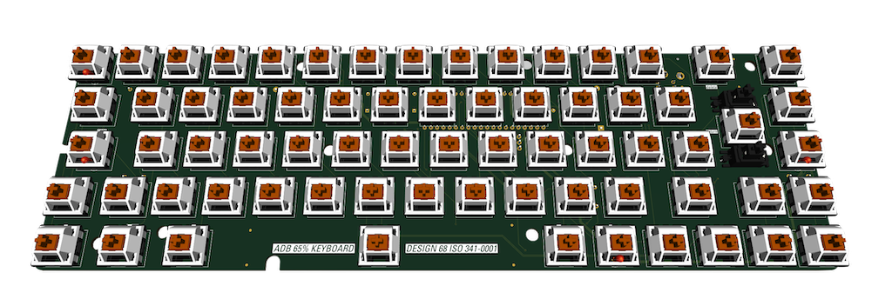

# Design68
65% DIY mechanical keyboard using AppleDesign controllers

### Elevator pitch
This project allow you to create an almost brand new 65% ADB (Apple Desktop Bus), with only the controller from a dead AppleDesign keyboard being harvested
It combines a CIY Tester68, use a custom PCB that can host the old AppleDesign controller

So far the project works and has been tester, but will probably work only with the ALPS 341-0001 Controller. Others controllers will probably need a different PCB
The controller is dual mode, and will boot into ISO or ANSI mode when installed in the respective PCB

### Base Materials
What's needed​
- Tester68 keyboard from CIY
- A dead AppleDesign keyboard
- 65% Apple styled keycap set (keychron has some nice ones)
- Design68 PCB
- 2U keycap stabilizer
- some tools (a Dremel would help greatly)
… and the BOM below

## BOM
### BOM (unless reclaimed)
The only thing that need to be reclaimed is the controller. The controller is the DIP40 chip labelled KS88C0504 or 341-0001.
Everything else, can be harvested or be bough as new using the BOM below

| Reference(s)          | Value      | Quantity | Notes                                  | Part number           |
|-----------------------|------------|----------|----------------------------------------|-----------------------|
| C1                    | 4.7uF      | 1        | axial electrolytic capacitor 11x5mm    | Vishay 2222-021-38478 |
| C2                    | 10uF       | 1        | axial electrolytic capacitor 11x5mm    | Vishay 2222-021-38109 |
| C3                    | 100nF      | 1        | axial ceramic capacitor 3.8x2.6mm      | KEMET C412C104K5R5TA  |
| C4                    | 2.2uF      | 1        | 10uF to 47uF 0603 SMT Tantale          | - [^1]                |
| D1, D2                | Diode      | 2        | 1N4148 SOD27 DO-35                     | TRU TC-1N4148         |
| J3                    | Mini DIN-4 | 1        | ADB connector                          | TE 5749263-1          |
| K1                    | DIP40      | 1        | DIP40 leaf type socket                 | TRU 40-LC-TT          |
| LED1, LED2, LED3      | 3mm LED    | 3        | standard 3mm THT LED                   | - [^2]                |
| R2, R3, R4            | 180Ω       | 3        | standard 0.25W carbon film resistor    | TRU TC-CFR0W4J0181    |
| SW1 to SW69           | SPST       | 69       | 5 pins Cherry MX switches              | MX1A-G1NW [^4]        |
| Y1                    | 4MHz       | 1        | resonator                              | Murata CSTLS4M00G53   |
| Cable                 | S-Video    | 1        | 2 meters S-Video cable		             | Lindy 35630           |

Optional (For Accent key backlighting [^3])

| Reference(s)          | Value      | Quantity | Notes                                  | Part number           |
|-----------------------|------------|----------|----------------------------------------|-----------------------|
| LED4                  | -          | 1        | standard 3mm THT LED                   | - [^2]                |
| R5                    | 470Ω       | 1        | standard 0.25W carbon film resistor    | TRU TC-CFR0W4J0471    |

[^1]: harvest from Tester68 PCB. Only needed without C2 (only one of them is needed)
[^2]: use prefered color. For shine thru keycaps, use from 30mcd to 100mcd. For underglow on solid keycaps, choose between 100mcd to 500mcd LEDs
[^3]: the accent key is the top left one. LED will always be on
[^4]: do I have to tell you to use your preferred keyswitches here ? Prefer thoses with 5 pins and THT LED mounting

### Keycaps
ISO Mac Keycap sets are quite rare.
Here is a few of them that are known to work nicely with this project:
- Keychron ISO Q1 & K2 OEM PBT keycap Retro set (DE-ISO UK-ISO Noridc-ISO FR-ISO IT-ISO ESP-ISO)
- Keychron ISO Q1 & K2 OEM PBT keycap Blue set (DE-ISO UK-ISO Noridc-ISO FR-ISO IT-ISO ESP-ISO)
- Keychron ISO Q1 & K2 OEM PBT keycap Carbon set (DE-ISO UK-ISO Noridc-ISO FR-ISO IT-ISO ESP-ISO)
- Keychron France ISO ABS Full Set Keycap (FR-ISO)

for ANSI, there is plenty of choice around (look at 65%/75% sets from Keychron or NuPhy)

### Community
Thread @ [68kmla](https://68kmla.org/bb/index.php?threads/design68-a-65-replacement-keyboard-using-appledesign-controllers.45326/)
Thread @ [TinkerDifferent](https://tinkerdifferent.com/threads/design68-a-65-replacement-keyboard-using-appledesign-controllers.2952/)
