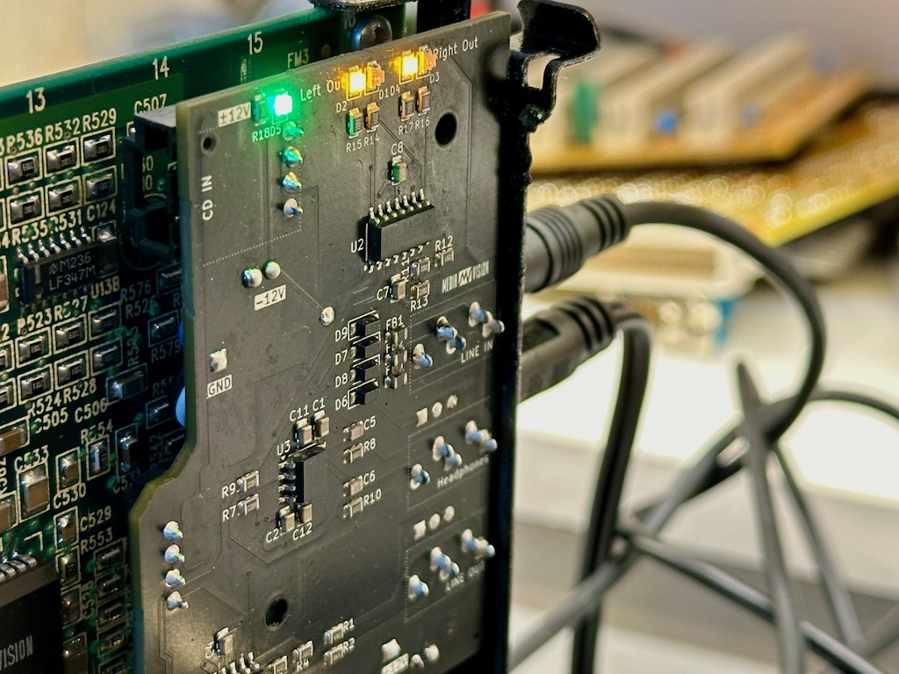

# NUBUSPAS16-DB

NuBus Pro Pro Audio Spectrum 16 daughter board

This is a hardware hack board to restore some functionality of a standalone MediaVision PAS16 (ie: it's single, witouth the breakout / patch panel)

As the board is unusable without the patch panel, this will give back some life out of such cards

Features
* The board restore the following features:
* Line output (buffered)
* Headphone amplifier (including support for high impedance headphones)
* Line in (switched between internal and external, more on this below)
* Hardware mixing of inputs and sound enhancements (bass, treble, loudness, stereo enhancer, external mute)

Features NOT restored:
* Microphone preamp
* Hardware mixing of multiple line inputs
* PC Joystick
* MIDI

Features are added:
* Debug LEDs (power, signal, peak for each channel)

### Board mofication
The modification of the original board involve removing the HD26 connector and two capacitors. This is reversible to the board can be modified back to its original configuration later

The bracked modification however, is destructive. Check community links below for pictures and TODOs

### Building

PCB thickness should be 1.6 milimeters 

This has been designed to about the same components used in the original board (SOIC + 0805), and can be build by your favorite PCBA service.
The bom + position files for JLCPCB assembly are avaiable inside the [NUBUSPAS16-DB](https://github.com/demik/oldworld/tree/master/EDA/NUBUSPAS16-DB/SMT) subdirectory. 

You will still need to buy the THT components somewhere else (•)

Full BOM if you want to build it from scratch:

| Reference(s)          | Value      | Quantity | Notes                                  | Part number           |
|-----------------------|------------|----------|----------------------------------------|-----------------------|
| C1-C4, C7-C8, C11-C12 | 100nF      | 8        | X7R 0805 Multilayer Ceramic Capacitors | Yag CC0805KRX7R9BB104 |
| C5, C6                | 47pF       | 2        | C0G 0805 Multilayer Ceramic Capacitors | SamEM CL21C470JBANNNC |
| C9, C10 (•)           | 100uF      | 2        | 6mm x 10mm Axial Capactitors           | Vishay 222202126101   |
| D1, D3                | Red        | 2        | 0805 Light Emitting Diodes             | Hubei KT-0805R        |
| D2, D4                | Yellow     | 2        | 0805 Light Emitting Diodes             | Hubei KT-0805Y        |
| D5                    | Emerald    | 1        | 0805 Light Emitting Diodes             | Hubei KT-0805G        |
| D6, D7, D8, D9        | 1N4148W    | 1        | SOD-123 Switching Diode                | ST 1N4148W            |
| FB1, FB2, FB3         | 300mΩ      | 3        | 0805 600Ω @ 100MHz Ferrite Beads       | Sunlord GZ2012D601TF  |
| J1, J7 (•)            | Header     | 2        | Single Row, Right Angle, 4 Circuits    | Molex 705530038       |
| J2 (•)                | Jack 3.5mm | 1        | low profile 3.5mm audio jack (green)   | CUI SJ1-3535NG-GR     |
| J3 (•)                | Jack 3.5mm | 1        | low profile 3.5mm audio jack (black)   | CUI SJ1-3535NG        |
| J5 (•)                | Jack 3.5mm | 1        | low profile 3.5mm audio jack (blue)    | CUI SJ1-3535NG-BE     |
| J4, J5 (•)            | 0.500"     | 2        | Board Stacking Header 0.1" pitch       | Samt DW-02-09-T-S-500 |
| J8, J9 (•)            | 0.500"     | 2        | Board Stacking Header 0.1" pitch       | Samt DW-03-09-T-S-500 |
| R1, R2                | 47Ω        | 2        | 125mW ±1% 0805 Chip Resistor           | UNI 0805W8F470JT5E    |
| R3, R4                | 10kΩ       | 2        | 125mW ±1% 0805 Chip Resistor           | UNI 0805W8F1002T5E    |
| R4, R6, R11, R18      | 20kΩ       | 4        | 125mW ±1% 0805 Chip Resistor           | UNI 0805W8F2002T5E    |
| R7, R8, R9, R10       | 680Ω       | 4        | 125mW ±1% 0805 Chip Resistor           | UNI 0805W8F6800T5E    |
| R12, R14-R17          | 2200Ω      | 5        | 125mW ±1% 0805 Chip Resistor           | UNI 0805W8F2201T5E    |
| R13                   | 220Ω       | 1        | 125mW ±1% 0805 Chip Resistor           | UNI 0805W8F2200T5E    |
| U1, U2                | LF347      | 2        | SOIC-14 FET Quad Input Op-Amplifiers   | STM LF347DT           |
| U3                    | OPA1688    | 1        | SOIC-8 R2R Audio Operational Amplifier | TI OPA1688ID          |

You will need three female dupont wires to sacrifice as well
The second Molex connector isn't mandatory, you can solder directly wires, but it makes assembly way easier

There is a second smaller PCB which is only build for cosmetic reasons

The gerbers files are downloadable [here](https://github.com/demik/oldworld/releases/download/SIMM72BL%2Fv1.1.0/SIMM72BL.zip)

### Community
Thread @ [68kmla](https://68kmla.org/bb/index.php?threads/nubuspas16-db-a-daughterboard-hack-to-restore-some-functionality-of-a-standalone-mediavision-pas16.47076/)