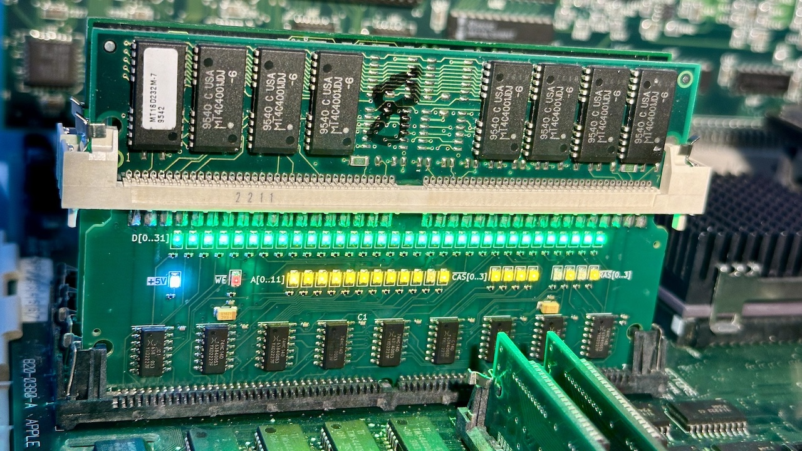

# SIMM72BL

SIMM 72 BlinkenLights

This is an interposer 72 pins memory SIMM tool for troubleshooting purposesi.
It was created to debug stuck lines on a memory controller, but you can probably use it to debug some bad memory chips as well

The top of the board has pads for probing, and you can solder an inline SIMM socket here as well.
Each line has its on activity LED

### Usage

Don't break your existing SIMM socket

### Building

PCB thickness should be 1.2 milimeters 

This has been designed to use only basic components, and can be build by your favorite PCBA service.
The corrected bom + position files for JLCPCB assembly are avaiable inside the [SMT](https://github.com/demik/oldworld/tree/master/EDA/SIMM72BL/SMT) subdirectory. You will still need to buy the SIMM connector if you want to support an inline memory module

Full BOM if you want to build it from scratch:

| Reference(s)          | Value      | Quantity | Notes                                  | Part number           |
|-----------------------|------------|----------|----------------------------------------|-----------------------|
| C1 to C9, C12, C13    | 100nF      | 11       | X7R 0402 Multilayer Ceramic Capacitors | SEM CL05B104KO5NNNC   |
| C10, C11              | 10uF       | 2        | 1206 Tantalum Capacitors               | AVX TAJA106K016RNJ    |
| D1 to 32              | Emerald    | 32       | 0805 Light Emitting Diodes             | Hubei KT-0805G        |
| D33 to D52            | Yellow     | 20       | 0805 Light Emitting Diodes             | Hubei KT-0805Y        |
| D53                   | White      | 1        | 0805 Light Emitting Diodes             | Hubei KT-0805W        |
| D54                   | Red        | 1        | 0805 Light Emitting Diodes             | Hubei KT-0805R        |
| R1 to R32, R53        | 3.3kΩ      | 33       | 0402 Chip Resistor 62.5mW              | Uni 0402WGF3301TCE    |
| R33 to R52, R54, R55  | 510Ω       | 22       | 0402 Chip Resistor 62.5mW              | Uni 0402WGF5100TCE    |
| U2 to U10             | 74HC14     | 9        | SOIC-14 6 Schmitt Trigger inverter     | Nextperia 74HC14D     |
| Connector             | SIMM72     | 1        | Vertical SIMM Connectors 72 connector  | TE 5822021-4          |

The SIMM connector pin spacing doesn't really match the PCB thickness. You will want to solder the back first with the pins flat, then bent the pins slightly on the front side, and use a little bit more solder than usual

The gerbers files are downloadable [here](https://github.com/demik/oldworld/releases/download/SIMM72BL%2Fv1.2.0/SIMM72BL_1.2.zip)
