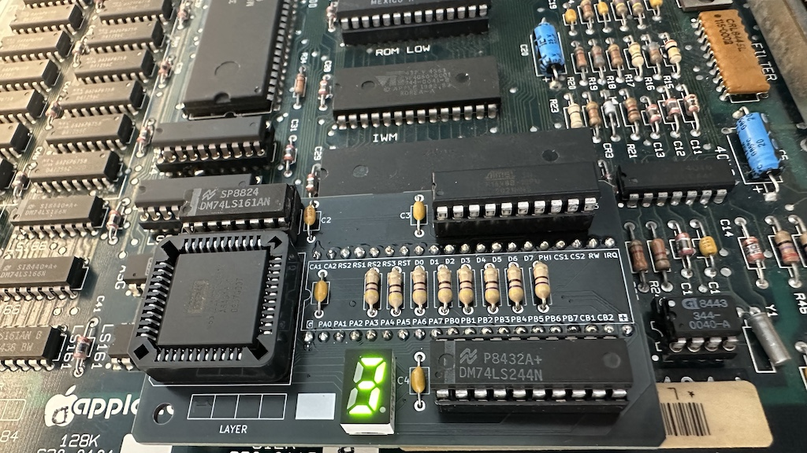

# VIA PLCC2DIP
Small diagnostic board that plug in place of the 6522 VIA (or on top of if you can find the correct clip). Inspired by the many ones included in ATX boards, it includes a 7 segment display which is useful for displaying the following informations:
- /RESET status
- OVERLAY status
- RTC pulse
- Vertical refresh pulse (slowed down to 3.75 Hz)
- Current sound volume level

Pins labelled on top of the PCB. Includes 6522 PLCC adapter

### Operation
The debug board is fully passive. No interaction needed. Display can be:

| Display | Meaning |
|---------|-----------------------|
| **r**   | RESET signal asserted |
| **o**   | ROM OVERLAY active    |
| **0**   | Silence               |
| **1**   | Sound level 1 (min)   |
| **2**   | Sound level 2         |
| **3**   | Sound level 3         |
| **4**   | Sound level 4         |
| **5**   | Sound level 5         |
| **6**   | Sound level 6         |
| **7**   | Sound level 7         |

Both RTC and VSYNC pulses are displayed using the decimal point LED. A 1Hz blink would implies that only the RTC is working, a 3.75 Hz blink would implies that only the VSYNC is working and there is some RTC related issues. Under normal operation both pulses are interleaved (looks like a random pulsing)

### Building, BOM
- One PLCC-44 Through-hole socket
- Machine pin headers (2x20)
- ATF16V8B(QL)-15PU or equivalent (most GALs are likely to work)
- 74LS161 HC series will likely work
- 74LS244 or any other 244 than can drive 8mA drive per pin
- 8x 470Ωstandard 0.25W carbon film resistor
- 4x 100nF axial ceramic capacitor (Kemet C412C104K5R5TA7200)

The gerbers files are downloadable [here](https://github.com/demik/oldworld/releases/download/VIA_Plus%2Fv1.2.0/VIA_Plus_1.2.zip)
